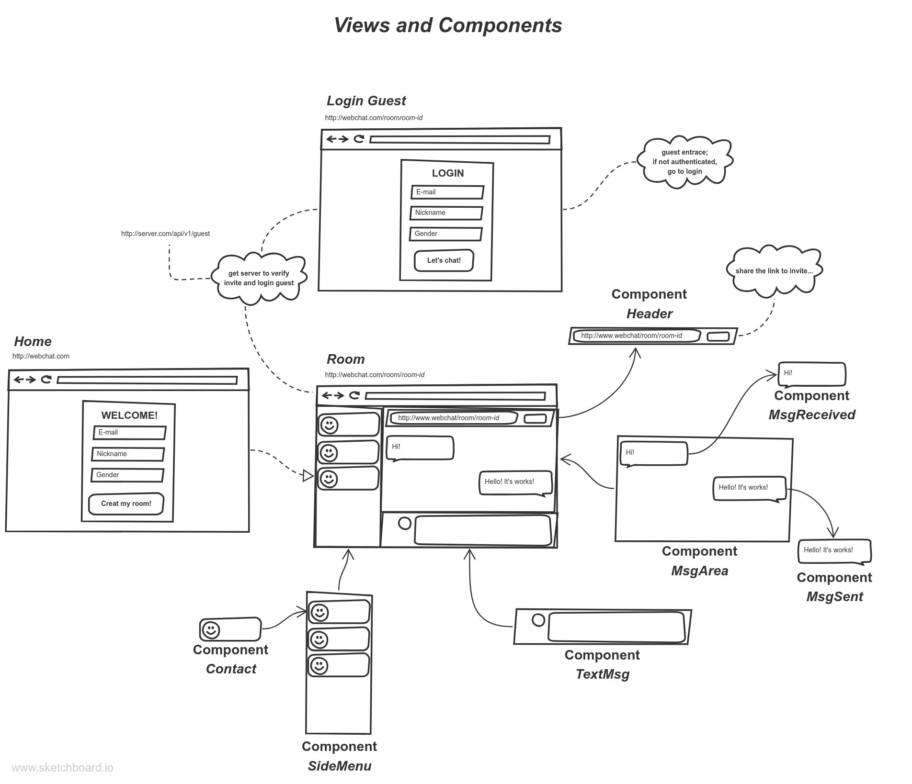
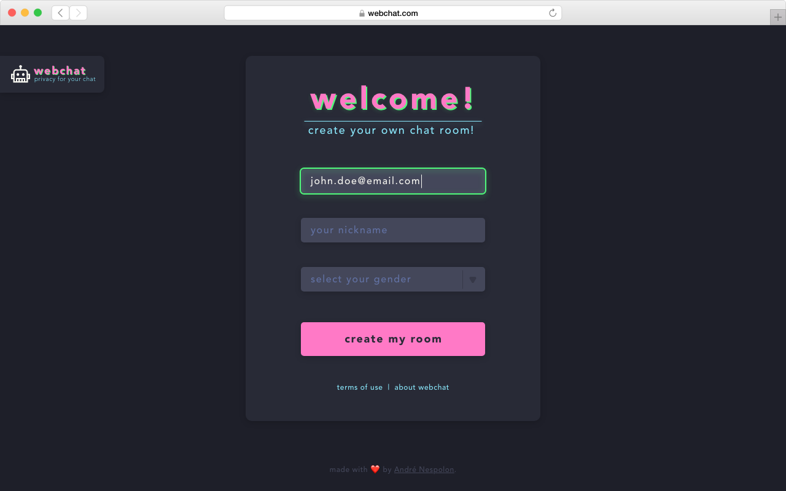

# webchat-react

[](https://github.com/andrenespolon/webchat-react.git)

This is a simple web chat project built with [React](https://pt-br.reactjs.org/), [Redux](https://redux.js.org/) and [Socket.io](https://socket.io/) (main libraries in the front-end). It's in progress and the idea is developing a web app to provides:

1. Private rooms to chat;
2. Send codes formating;
3. Theming the environment;
4. Simples invites;
5. Some fun;

## Views and Components
Views and components are builts some like this:


## Prototype
The XD prototype is available [here]().
### Login


### Chat Room
.png)

### Error 404


## Todos
### Front-end
- [ ] Components (in progress)
- [X] Theming
- [X] Routes
- [ ] Pages
- [X] Robot avatars

### Back-end
- [ ] Socket
- [ ] Requests

## Run
Structure of main folders:
```
webchat-react
  |-client
    |-public
    |-src
      |-App.js
      |-index.js
      |-components
      |-...
  |-server
    |-index.js
```
So far, you can do:
- Clone this repo;
- Go to the client folder and run `yarn` and `yarn start` (or `npm i` and `npm start`).
- And browse to `http://localhost:3000/room/1234`

> Note: temporarily 1234 will simulate a room id.

## License
MIT